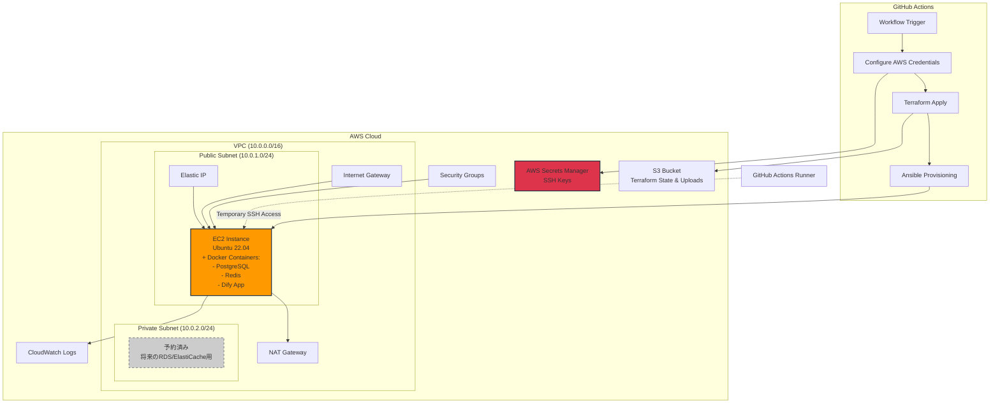
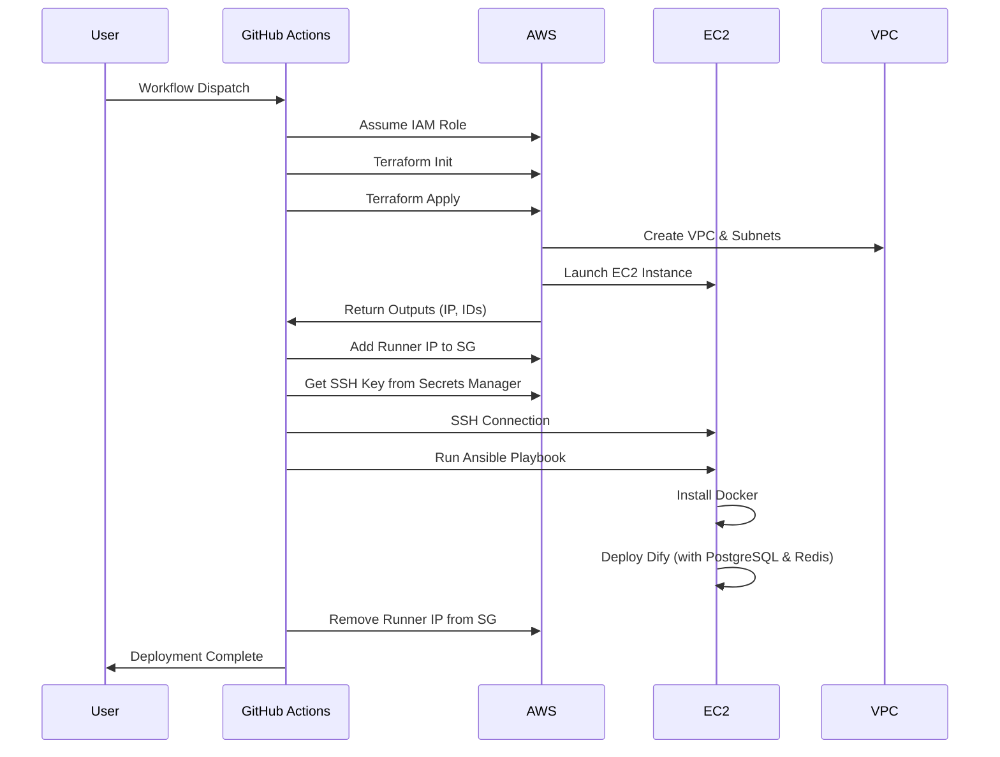

# Dify on AWS インフラ構成図

## システム概要

このドキュメントは、AWS上でDify環境を自動構築するためのインフラ構成を示しています。

**注意**: この構成は**開発・テスト環境向け**です。DifyのDocker Compose内に含まれるPostgreSQLとRedisをEC2インスタンス上で実行します。マネージドデータベース（RDS）やマネージドキャッシュ（ElastiCache）は使用しません。

## アーキテクチャ図



## コンポーネント詳細

### 1. ネットワーク層

#### VPC (Virtual Private Cloud)
- **CIDR ブロック**: 10.0.0.0/16
- **リージョン**: ap-northeast-1 (東京) ※変更可能
- **DNS解決**: 有効
- **DNSホスト名**: 有効

#### サブネット構成

##### Public Subnet
- **CIDR**: 10.0.1.0/24
- **用途**: EC2インスタンス (Difyアプリケーション)
- **インターネットアクセス**: Internet Gateway経由

##### Private Subnet
- **CIDR**: 10.0.2.0/24
- **用途**: RDS PostgreSQL, ElastiCache Redis
- **インターネットアクセス**: NAT Gateway経由

### 2. コンピューティング層

#### EC2インスタンス
- **インスタンスタイプ**: t3.medium (推奨)
- **OS**: Ubuntu 22.04 LTS
- **ストレージ**: 
  - Root Volume: 30GB gp3
  - Data Volume: 50GB gp3 (Docker volumes用)
- **配置**: Public Subnet
- **Elastic IP**: 割り当て済み

#### インストールされるコンポーネント (Ansible経由)
- Docker Engine
- Docker Compose
- **Dify アプリケーション** (Docker Compose内に以下を含む)
  - PostgreSQL (データベース)
  - Redis (キャッシュ)
  - Nginx
  - API サーバー
  - Worker
  - その他Difyコンポーネント

### 3. データベース・キャッシュ層

**注意**: 現在の構成では、マネージドサービス（RDS/ElastiCache）は使用していません。すべてEC2インスタンス上のDockerコンテナとして実行されます。

#### Docker内PostgreSQL
- **エンジン**: PostgreSQL (Dify Docker Composeで指定されたバージョン)
- **配置**: EC2インスタンス内のDockerコンテナ
- **永続化**: Docker Volume (/data/docker配下)
- **バックアップ**: 手動またはEC2スナップショット

#### Docker内Redis
- **エンジン**: Redis (Dify Docker Composeで指定されたバージョン)
- **配置**: EC2インスタンス内のDockerコンテナ
- **永続化**: Docker Volume (/data/docker配下)

#### 本番環境への移行時の考慮事項
本番環境では以下のマネージドサービスへの移行を推奨:
- **RDS PostgreSQL**: 高可用性、自動バックアップ、ポイントインタイムリカバリ
- **ElastiCache Redis**: 自動フェイルオーバー、マルチAZ配置

これらのリソースはTerraformコード内でコメントアウトされており、必要に応じて有効化できます。

### 4. セキュリティ

#### Security Groups

##### EC2 Security Group
```
Inbound Rules:
- HTTP (80): 0.0.0.0/0
- HTTPS (443): 0.0.0.0/0
- SSH (22): GitHub Actions Runner IP (一時的)
- Custom TCP (80): ALB Security Group (将来的な拡張用)

Outbound Rules:
- All Traffic: 0.0.0.0/0
```

##### RDS Security Group (コメントアウト済み)
```
将来のマネージドデータベース使用時のために予約
```

##### ElastiCache Security Group (コメントアウト済み)
```
将来のマネージドキャッシュ使用時のために予約
```

#### AWS Secrets Manager
保存されるシークレット:
- SSH秘密鍵 (EC2アクセス用)
- SSH公開鍵

**注意**: RDS/ElastiCacheを使用しないため、データベース認証情報は保存されません。必要に応じてDifyの.envファイルで管理してください。

### 5. ストレージ

#### S3 Bucket
- **用途**: 
  - Terraformステートファイル
  - Difyアップロードファイル
  - EC2バックアップデータ (手動)
- **バージョニング**: 有効
- **暗号化**: SSE-S3
- **ライフサイクルポリシー**: 90日後にGlacierへ移行

### 6. 監視・ログ

#### CloudWatch Logs
ログストリーム:
- EC2システムログ
- Dockerコンテナログ
- Difyアプリケーションログ
- Nginxアクセスログ

#### CloudWatch Metrics
監視メトリクス:
- EC2: CPU使用率、メモリ使用率、ディスクI/O
- Docker: コンテナの状態、リソース使用率 (カスタムメトリクス)

#### CloudWatch Alarms
アラーム設定例:
- EC2 CPU使用率 > 80%
- EC2 ディスク使用率 > 85%
- Docker PostgreSQLコンテナ停止検知

## デプロイメントフロー



## 事前準備

### 1. Terraformバックエンド用のS3バケット・DynamoDBテーブル作成

Terraformのステートファイルをチームで共有し、同時実行を防ぐために、S3バケットとDynamoDBテーブルを事前に作成する必要があります。

#### S3バケットの作成（Terraformステート保存用）

```bash
# S3バケットの作成
aws s3api create-bucket \
  --bucket dify-terraform-state \
  --region ap-northeast-1 \
  --create-bucket-configuration LocationConstraint=ap-northeast-1

# バージョニングを有効化（誤削除防止）
aws s3api put-bucket-versioning \
  --bucket dify-terraform-state \
  --versioning-configuration Status=Enabled

# 暗号化を有効化
aws s3api put-bucket-encryption \
  --bucket dify-terraform-state \
  --server-side-encryption-configuration '{
    "Rules": [{
      "ApplyServerSideEncryptionByDefault": {
        "SSEAlgorithm": "AES256"
      }
    }]
  }'

# パブリックアクセスのブロック
aws s3api put-public-access-block \
  --bucket dify-terraform-state \
  --public-access-block-configuration \
    "BlockPublicAcls=true,IgnorePublicAcls=true,BlockPublicPolicy=true,RestrictPublicBuckets=true"
```

#### 確認コマンド

```bash
# S3バケットの確認
aws s3 ls | grep dify-terraform-state

# DynamoDBテーブルの確認
aws dynamodb describe-table --table-name dify-terraform-locks --region ap-northeast-1
```

**注意**: これらのリソースは、Terraformを実行する前に一度だけ手動で作成してください。

### 2. IAM OIDC Provider とロールの作成

GitHub ActionsからAWSにアクセスするためのOIDCプロバイダーとIAMロールを作成します。

詳細は[GitHub Actions OIDC設定ガイド](https://docs.github.com/ja/actions/deployment/security-hardening-your-deployments/configuring-openid-connect-in-amazon-web-services)を参照してください。

## 環境変数・パラメータ

### GitHub Secrets (必須設定)
```
AWS_ROLE_ARN: arn:aws:iam::ACCOUNT_ID:role/github-actions-role
```

### Workflow Inputs
- `environment_name`: 環境名 (dev/staging/prod)
- `vpc_cidr`: VPC CIDRブロック (デフォルト: 10.0.0.0/16)
- `aws_region`: AWSリージョン (デフォルト: ap-northeast-1)

## コスト見積もり (月額・東京リージョン)

**開発・テスト環境向け構成 (マネージドDB/キャッシュなし)**

| リソース | スペック | 月額概算 (USD) |
|---------|---------|---------------|
| EC2 (t3.medium) | 2vCPU, 4GB RAM | $30 |
| EBS (80GB gp3) | Root + Data | $8 |
| Elastic IP | 1個 | $3.6 |
| NAT Gateway | データ転送込み | $35 |
| S3 Storage | ~50GB | $1.2 |
| CloudWatch Logs | ~10GB/月 | $5 |
| Secrets Manager | 2シークレット | $0.8 |
| **合計** | | **約 $83/月** |

※上記は概算です。実際の使用状況により変動します。

### 本番環境向け構成（RDS/ElastiCache使用時）

マネージドサービスを有効化した場合の追加コスト:

| リソース | スペック | 月額概算 (USD) |
|---------|---------|---------------|
| RDS (db.t3.small) | 2vCPU, 2GB RAM | $25 |
| RDS Storage (20GB) | gp3 | $2.3 |
| ElastiCache (cache.t3.micro) | 0.5GB RAM | $12 |
| **本番環境合計** | | **約 $122/月** |

## セキュリティベストプラクティス

1. ✅ **最小権限の原則**: IAMロールは必要最小限の権限のみ付与
2. ✅ **暗号化**: 転送中・保管中のデータを暗号化
3. ✅ **プライベートサブネット**: データベースはプライベートサブネットに配置
4. ✅ **一時的アクセス**: GitHub Actions RunnerのIPは作業後に削除
5. ✅ **シークレット管理**: 認証情報はSecrets Managerで管理
6. ✅ **ネットワーク分離**: Security Groupで厳密なアクセス制御
7. ✅ **監査ログ**: CloudTrailで全API呼び出しを記録

## 運用・保守

### バックアップ戦略
- **EC2**: AMI作成 (週次) + EBSスナップショット
- **Docker Volumes**: 定期的なバックアップスクリプト (S3へ保存)
- **S3**: バージョニング有効化

**注意**: Docker内のPostgreSQL/Redisはマネージドサービスのような自動バックアップがないため、手動バックアップスクリプトの実装が必要です。

### スケーリング戦略
- **垂直スケーリング**: インスタンスタイプの変更
- **水平スケーリング**: Auto Scaling Group + ALB (将来的な拡張)

### ディザスタリカバリ
- **RTO (Recovery Time Objective)**: 4時間
- **RPO (Recovery Point Objective)**: 24時間
- **マルチリージョン**: 本番環境では検討推奨

## 今後の拡張予定

1. **マネージドサービスへの移行** (本番環境向け)
   - RDS PostgreSQL: 高可用性とバックアップの自動化
   - ElastiCache Redis: フェイルオーバーとスケーリング
2. **Application Load Balancer**: 複数EC2インスタンスへの負荷分散
2. **Auto Scaling**: トラフィックに応じた自動スケーリング
3. **CloudFront**: CDN配信によるパフォーマンス向上
4. **WAF**: Webアプリケーションファイアウォール
5. **Multi-AZ構成**: 高可用性の実現
6. **ECS/Fargate**: コンテナオーケストレーション

## トラブルシューティング

### よくある問題と解決方法

#### 1. Terraform Apply失敗
```bash
# ステート確認
terraform state list

# ステートのロック解除
terraform force-unlock <LOCK_ID>
```

#### 2. SSH接続失敗
- Security GroupにRunner IPが追加されているか確認
- SSH鍵のパーミッションが600か確認
- EC2インスタンスのステータスが"running"か確認

#### 3. Ansible Playbook失敗
```bash
# デバッグモードで実行
ansible-playbook -i hosts.ini playbook.yml -vvv
```

## 関連ドキュメント

- [Terraform設定](/infra/terraform/README.md)
- [Ansible Playbook](/infra/ansible/README.md)
- [Dify公式ドキュメント](https://docs.dify.ai/)

## ライセンス

このプロジェクトのインフラコードはMITライセンスの下で公開されています。
