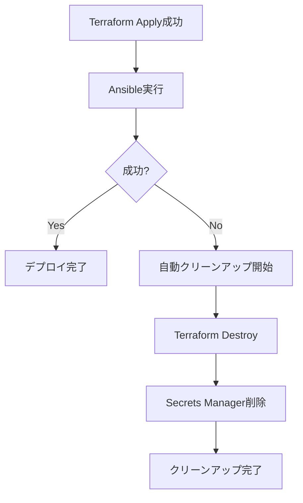

# AWSリソース クリーンアップガイド

このディレクトリには、AWS上に構築されたDifyリソースをクリーンアップするためのスクリプトとワークフローが含まれています。

## 📋 目次

- [ローカルスクリプトでのクリーンアップ](#ローカルスクリプトでのクリーンアップ)
- [GitHub Actionsでのクリーンアップ](#github-actionsでのクリーンアップ)
- [自動クリーンアップ機能](#自動クリーンアップ機能)

## 🖥️ ローカルスクリプトでのクリーンアップ

### 前提条件

- AWS CLI がインストール・設定済み
- Terraform がインストール済み
- 適切なAWS認証情報が設定済み

### 使用方法

```bash
# デフォルト (dev環境、ap-northeast-1リージョン)
./scripts/cleanup-aws-resources.sh

# 環境とリージョンを指定
./scripts/cleanup-aws-resources.sh staging ap-northeast-1
```

### 実行内容

1. **Terraformリソースの削除**
   - VPC、サブネット、ルートテーブル
   - EC2インスタンス、Elastic IP
   - NAT Gateway
   - Security Groups
   - IAMロール、ポリシー
   - S3バケット（アップロード用）※ステート用バケットは除く

2. **Secrets Managerのクリーンアップ**
   - SSH秘密鍵の強制削除
   - SSH公開鍵の強制削除

3. **残存リソースの確認**
   - EC2インスタンス
   - NAT Gateway
   - Elastic IP

## ☁️ GitHub Actionsでのクリーンアップ

### 手動実行

1. GitHubリポジトリにアクセス
2. **Actions** タブをクリック
3. 左サイドバーから **AWS リソースクリーンアップ** を選択
4. **Run workflow** ボタンをクリック
5. 環境名を入力 (例: `dev`)
6. 確認フィールドに `yes` と入力
7. **Run workflow** をクリック

### ワークフローURL

```
https://github.com/kazuki1016/dify-terraform/actions/workflows/cleanup-aws-resources.yml
```

## 🔄 自動クリーンアップ機能

メインのデプロイワークフロー (`create_dify_on_aws.yml`) には、**失敗時の自動クリーンアップ機能**が組み込まれています。

### 動作条件

- Terraform Apply が成功した後
- その後のステップ（Ansible実行など）で失敗した場合

### 自動実行内容

1. Terraform destroy を実行
2. Secrets Manager のシークレットを強制削除
3. クリーンアップ完了メッセージを表示

### 動作フロー



## ⚠️ 注意事項

### 保持されるリソース

以下のリソースは**削除されません**（意図的に保持）:

- **S3バケット**: `dify-terraform-state-*`
  - 用途: Terraformステートファイルの保存
  - 理由: 複数環境で共有、再デプロイ時に必要

- **DynamoDBテーブル**: `dify-terraform-locks`
  - 用途: Terraformステートのロック管理
  - 理由: 同時実行の防止に必要

### 削除の遅延

一部のリソースは削除完了まで時間がかかる場合があります:

- **NAT Gateway**: 削除に最大5分
- **Elastic IP**: アソシエーション解除後に削除可能
- **Secrets Manager**: 削除保護期間（デフォルト7日）
  - スクリプトでは `--force-delete-without-recovery` を使用して即座に削除

### Secrets Managerの削除保護

通常、Secrets Managerのシークレットは削除後7日間の保護期間がありますが、このスクリプトでは以下のオプションで**即座に削除**します:

```bash
--force-delete-without-recovery
```

⚠️ **警告**: このオプションを使用すると、シークレットは即座に削除され、復元できません。

## 🛠️ トラブルシューティング

### Terraform destroy が失敗する

**原因**: リソース間の依存関係により削除がブロックされている

**解決策**:
```bash
# ステートをリフレッシュ
cd infra/terraform/aws
terraform refresh -var="environment=dev" -var="aws_region=ap-northeast-1"

# 再度 destroy を実行
terraform destroy -var="environment=dev" -var="aws_region=ap-northeast-1"
```

### Secrets Manager の削除エラー

**エラー**: `InvalidRequestException: You can't delete a secret that is pending deletion.`

**解決策**: シークレットは既に削除予定です。無視して問題ありません。

### リソースが残っている

**原因**: AWSコンソールの表示遅延、または手動で作成されたリソース

**確認方法**:
```bash
# EC2インスタンスの確認
aws ec2 describe-instances \
  --filters "Name=tag:Environment,Values=dev" \
            "Name=tag:System,Values=Dify" \
  --region ap-northeast-1

# NAT Gatewayの確認
aws ec2 describe-nat-gateways \
  --filter "Name=tag:Environment,Values=dev" \
           "Name=tag:System,Values=Dify" \
  --region ap-northeast-1
```

## 📞 サポート

問題が発生した場合は、以下を確認してください:

1. AWS CLIの認証情報が正しく設定されているか
2. 実行ユーザーに適切な権限があるか
3. Terraformのバージョンが要件を満たしているか (>= 1.6.0)

---

**最終更新**: 2025年11月3日
